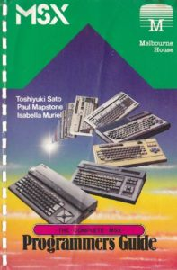

# Books

## Do-It-Yourself articles in Books and Magazines

On this page you find scanned books. The books sections contains relevant
reference material (in english) and all (dutch) books I know of about the
combination of electronics and the MSX..

Note that the [Do It Yourself](/do-it-yourself/) pages shows how to build
memory expanders, slot expanders and other standard enhancements applicable
to MSX.

## Books

**Reference manuals in English**

[The MSX Redbook](https://files.techinfo.newmsx.nl/books/aredbook.zip) in PC
compatible characterset, text in zip format, english, adapted

[The appendix](https://files.techinfo.newmsx.nl/books/redbookapp.pdf) of the
MSX Redbook, pdf format

Part of the [Dutch MSX Redbook](https://files.techinfo.newmsx.nl/books/nlredb.pdf)

[MSX-2 Technical Reference Manual](https://files.techinfo.newmsx.nl/books/msxtech2.zip),
typed in by Nestor Soriano (updated with missing chapters 5, KUN basic)

Official
[MSX-DOS 2.20 programming](https://files.techinfo.newmsx.nl/books/msxdos22.zip),
functional and command interpreter description, also in
[PDF format](https://files.techinfo.newmsx.nl/books/msxdos22.pdf)
(thanks to Ag0ny)

[MSX Technical handbook](https://files.techinfo.newmsx.nl/books/msxtech.pdf)

## MSX 2 Technical Handbook scanned

[0. Contents](https://files.techinfo.newmsx.nl/books/msx2th00.pdf)
[7. Notes for MSX software developers](https://files.techinfo.newmsx.nl/books/msx2th07.pdf)
[14. MSX2 video superimposition unit specification](https://files.techinfo.newmsx.nl/books/msx2th14.pdf)
[15. MSX Expansion I/O port](https://files.techinfo.newmsx.nl/books/msx2th15.pdf)
[16. MSX Memory mapper specification](https://files.techinfo.newmsx.nl/books/msx2th16.pdf)

## MSX BIOS

The MSX BIOS book, published by Quest for ASCII, is available in pdf format.
This book contains the well commented official and original source listing
in assembler format of the BIOS of the MSX 1 computer. This book gives a
detailed inside look in the MSX system.  
[Part 1](https://files.techinfo.newmsx.nl/books/msxbioslistingpart1.pdf)
pages 1-280 MSX BIOS listing and cross reference  
[Part 2](https://files.techinfo.newmsx.nl/books/msxbioslistingpart2.pdf)
pages 281-356 Symbol table. International overlays, BIOS Calls, Character set,
keyboard layouts, Hooks and RAM routines

## Books

Toshiyuki Sato, Paul Mapstone, Isabella Muriel, [The Complete MSX Programmers Guide](https://files.techinfo.newmsx.nl/books/The_Complete_MSX_Programmers_Guide.pdf)

Ian Sinclair – [Working with MSX BASIC](https://files.techinfo.newmsx.nl/books/IanSinclairWorkingwithMSXBASIC.pdf)

Graham Bland - [MSX Programming](https://files.techinfo.newmsx.nl/books/MSX_Programming-Graham_Bland.pdf)

Lisa Watts and Mike Wharton - [Machine code for beginners](https://files.techinfo.newmsx.nl/books/machinecodeforbeginners.pdf)

## Books in Dutch

Het complete boek Grafische Experimenten voor MSX Computers  
[deel 1](https://files.techinfo.newmsx.nl/books/dreumelgrafisch1.pdf)  
[deel 2](https://files.techinfo.newmsx.nl/books/dreumelgrafisch2.pdf)  
gepubliceerd met toestemming van de auteur W.H.M. van Dreumel

[Elektronica projecten voor MSX computers](https://files.techinfo.newmsx.nl/books/elproj.pdf)
W.H.M. van Dreumel  
Standaard werk voor gebruik joystick interface, printer en zelfbouw interfaces
in elektronica projecten zoals analoge ingangen, lichtnet besturing enzovoort,
het gehele boek met toestemming van de auteur!

[Eenvoudige Interface Schakelingen voor MSX en Schneider computers](https://files.techinfo.newmsx.nl/books/eenvoudint.pdf)  
Vele zelfbouw projecten met MSX joypoort en printerpoort.

[Toepassingen voor MSX computers](https://files.techinfo.newmsx.nl/books/toep.pdf)  
Hoofdstuk 4: Besturingsprogramma’s met Interface voor Lego modellen, modelbaan, tekenhaak

[Programma’s behorende bij het boek Toepassingen voor MSX computers](https://files.techinfo.newmsx.nl/books/toep.zip)

[MSX-2 handboek boek voor gevorderde](https://files.techinfo.newmsx.nl/books/msx2boek.pdf)  
Achtergrond informatie voor programmeurs

[Part of the Dutch MSX Redbook](https://files.techinfo.newmsx.nl/books/nlredb.pdf)

[Modelspoor Control Systeem](https://files.techinfo.newmsx.nl/books/mcs.pdf)  
Eindhovense Modelbouw Vereniging

[FM-PAC Verder uitgediept](https://files.techinfo.newmsx.nl/books/fmpacuitg.pdf)
Uitgebreide beschrijving van de FM-PAC en MSX MUSIC, gebruik vanuit Basic, SRAM

The book [MSX Computers en de Buitenwereld](https://files.techinfo.newmsx.nl/books/msxbuiten.pdf)
, a Dutch book about interfacing via hardware the MSX and a worthfull addition
in the style ofthis site! Describes how to build paddles and a 8255 based
interface with digital and analog i/o, even an EPROM programmer (quite
identical to the Toeprom programmer).