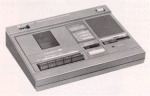
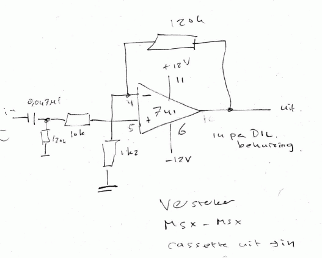
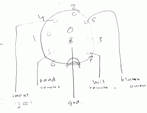
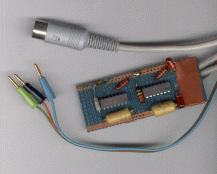
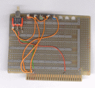

# The MSX cassette system

On a MSX without disk drive the only way to work with files is using the
cassette system of MSX. And since MSX 1 computers and some MSX 2 types do not
have a disk system most of us started working with MSX listening and cursing
that slow and noisy cassette tape system.

In fact the cassette system for storing files on MSX is not that bad. The
cassette routines are quite smart in detecting speed differences, the
standard MSX routines automatically can work with differences in tape speed
and are quite forgiving in outputlevel and differences in the position of the
cassette read head alignment. Also speed is slow (1200 baud) or not that slow
(2400 baud). Note that MSX is very week in detecting load errors.

All you want to know about the technical details and programming bios calls of
MSX can be found in the [MSX Red book]().
Hardware circuit diagrams can be found in the service manuals on the hardware
page.

As an example of how to use the tape related MSX BIOS calls programs see these
sources of routines to read and write the screen contents from and to tape 
by M.C. de Jong.

When I got my first MSX computer (a Toshiba HX-10) i tried to use my simple
cassette recorder but it failed all the time. So i bought a WH Smith tape
system that is optimised for computer systems: variable output level, can be
controlled by the MSX (the MOTOR command, hear the clicks!) and has the option
of no/quiet/normal speaker output. A very nice device and i could read all the
tapes and record at 2400 baud.

## Tricks

Getting the MSX reading tapes does require some tricks often:

1. Head alignment: Use a small screwdriver to turn a bit the screw next to the
   cassette recording head to align the tape. A good MSX cassette tape
   recorder as the WH SMith type has a hole for this purpose. Listen to the
   tone and optimise for the pitch as sharp as possible.
2. Cleaning: keep the head of the tape recorder clean with alcohol and a clean
   wipe.
3. TV/monitor interference: disconnect the TV or monitor from the MSX and
   listen to the sound if hum and hiss are becoming less. I used thos trick
   for some very difficult to read tapes.
4. High volume: the reading results may become better if the cassette recorder
   is set to as loud as possible.
5. Retry: note that MSX cassette files are not checked for errors! So it is
   possible to see the program being loaded and then crashing in all sorts of
   ways. Retry then with any of the tricks above. At least check what is on
   the tape with the TAPDIR program : it shows all blocks (basic programs,
   binary programs, ascii text files or ‘unknown’ blocks.

## Copying MSX cassette tapes

To copy a MSX cassette tape there is more than one way:

* Copy the output of the cassette recorder on another cassette recorder. A
  method with low chance of success but it might work.
* Use a program like COPMSX to copy all blocks one by one to another tape.
  This program not only allows to copy the cassette tape contents but can also
  convert from 1200 to 2400 baud or the other way around. [Here](tapdir.zip) you find the
  program with assembler (TASM) source ,written in 1985 for MSX and adapted in
  2001 to english and MSX-2.
* Record the output of the cassette recorder on a PC with a soundcard.
  With any wave editing program (i like Cooledit on Windows, but any program
  on any platform will do) you can clean up the wave file, filter out hum
  (50 Hz for example) and improve the volume (normalize). Be carefull with
  filtering! And make sure that the recording level is optimal: no clipping!!,
  not too soft either. 44KHz mono 8 bit is fine, 22KHz also works fine but
  44 KHZ allows more editing experiments. The resulting wave file can be stored
  on a cassette tape again or stored on an audio cd or just played back from
  the PC. Ofcourse only a cassette recorder can be stopped and started with the
  Remote control by the MSX, otherwise you have to stop and start playback
  manually. If you store the wave file on an audio or have enough disk space:
  use 44KHz 16 bit stereo. Using mp3 format or other compressed formats will
  work if you set the quality settings high enough, for example 320Kb for mp3
  works from p3 players.

## New tricks

Cassette recorders are quite low quality (lofi, not hifi) audio recording
devices. 2400 baud is the maximum speed you can achieve with these devices.
And cassette tapes can break, wear, loose high tones in the end.

Now there are several ways to use the cassette interface without that old-
fashioned cassette recorder:
* use another MSX (preferrably with disk drive) as source
* use a PC with soundcard as the ultimate cassette recorder

Ofcourse you need to have either one of these devices! But if you are reading
this article, it is quite certain you use a computer with decent sound
facilities.

## MSX as cassette recorder

When I bought my second MSX computer ( a Spectravideo X’Press SVI.738 with a
360KB diskdrive) i wanted to continue using my first MSX computer (remember,
the Toshiba HX-10) and checked if the output of the Spectravideo could be
send to the Toshiba (CSAVE on the SVI.738 and CLOAD on the HX-10). It does
not work by just connecting output to input (you have to make your own cables
anyway) , the signal needs to be amplified (10x was enough). See the next
diagram for a simple opamp based amplifier and the connector.

  
  

Simple to construct on experimenters board. I took the easy way by using the
+ 12V and – 12 V from the MSX cartrdige connector as shown in the next figures.

  
  

## PC as cassette recorder

Record the output of the cassette recorder on a PC with a soundcard. With any
wave editing program (i like Cooledit on Windows, but any program on any
platform will do) you can clean up the wave file, filter out hum (50 Hz
for example) and improve the volume (normalize). Be carefull with filtering!
And make sure that the recording level is optimal: no clipping!!!, not too
soft either. 44KHz mono 8 bit is fine, 22KHz also works fine but 44 KHZ allows
more editing experiments. The resulting wave file can be stored on a cassette
tape again or stored on an audio cd or just played back from the PC. Ofcourse
only a cassette recorder can be stopped and started with the Remote control by
the MSX, otherwise you have to stop and start playback manually between the
blocks.

The PC is such a good recorder that you can do some editing which makes loading
much faster: triple the speed to 3600 baud! Ofcourse this only works when the
sample frequency is high enough: 44KHz is required.

## Audio CD player as cassette recorder/player

Of course this is only a playback facility! Record the cassette output as
described above (or use one of the tools below) and convert the separate blocks
to Wave (PCM 44 KHz 16 bit stereo files). Burn these wave files as separate
tracks to an audio cd and play the tracks as needed by the MSX loading program.

Using mp3 format or other compressed formats will work if you set the quality
settings high enough, for example 320Kb for mp3 works from mp3 players.

You can combine the typical MSX header (the block with the long header and the
small data block) and the data block as one track, make sure there is some
silence between header and datablock.

Note that the idea of using a audio CD as source of cassette formatted data is
not new, Aackosoft produced aCD sequentiel CD with games and an improved
loader routime. The CD is in cas format on funet, here you have the MSX Games
Collection sequential CD [first track](cdgames1.zip)) and
[third track](cdgames3.zip) (wave format).

