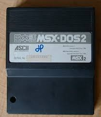
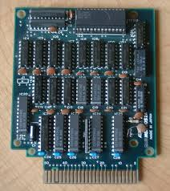
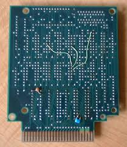
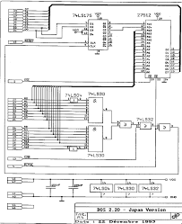

# MSX DOS 2

For more information on MSX DOS 2 do-it-yourself see the page
[Dos and disks](/do-it-yourself/dos-and-disks/)

[MSX DOS 2 programming manual](https://files.techinfo.newmsx.nl/technical-info/msx-dos-2/msxdos22.zip)

## ASCII MSX-DOS2 and 256k memory mapper cartridge

With thanks to Jipe (Jean Pierre Dubois) images and circuit diagram of the
ASCII MSX DOS 2

[MSX DOS 2 ROMS](https://files.techinfo.newmsx.nl/technical-info/msx-dos-2/rom-dos22ascii.zip)

[MSX DOS 2 ROMS (2.1.2.2.2.3 english and japanese disks)](https://files.techinfo.newmsx.nl/technical-info/msx-dos-2/msxdos22complete.zip)

  
  
  
