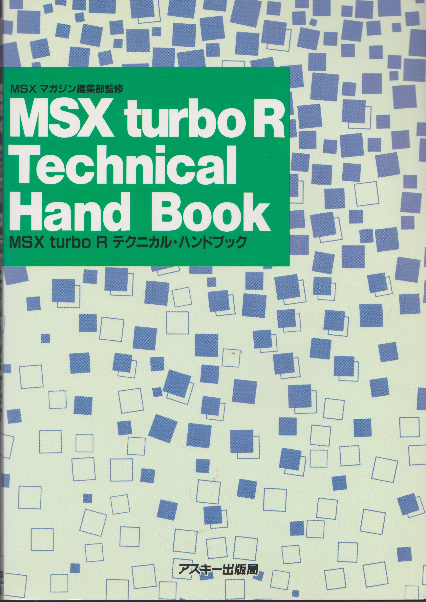

# MSX Turbo R

  

The final manufactured and most advanced MSX computer is the MSX turboR,
available in two types:

    Panasonic FS-A1ST MSX turbo R , R800 cpu, 128K, MSX2+ video
    Panasonic FS-A1GT MSX turbo R with 512K memory, SRAM disk and a midi interface

These machines were only made for the Japanese market, so buying and using
the MSX turbo R in other countries was a bit of a challenge. For example:
the builtin software is in Japanese, the documentation is in Japanese.

Users in the Netherlands (there has been a very active import circuit) have
written down instructions and impressions. This is to be found in the magazines
section.

## Technical info

[Floppy disk controller](https://files.techinfo.newmsx.nl/technical-info/msx-turbor/floppyfdc.txt)
(email from the MSX mailing list), register info

[Repair the floppy disk drive](https://files.techinfo.newmsx.nl/technical-info/msx-turbor/turbordrive.pdf)
(magazine article, emails from the MSX mailing list, web pages): working and
tested instructions in english and dutch how to repair a drive, add a second
drive and/or replace it. Also [see the article](/do-it-yourself/msx-floppy-drives)
on repairing the floppy disk drive in the MSX.

[Replace the belt of a floppy disk drive](https://files.techinfo.newmsx.nl/technical-info/msx-turbor/panasonicturborreplacebet.pdf)
in the turboR: picture instructions

[TurboR ST service manual](https://files.techinfo.newmsx.nl/technical-info/msx-turbor/panasonicturborstsm.pdf)

[TurboR GT service manual black and white small version](https://files.techinfo.newmsx.nl/technical-info/msx-turbor/panasonicturborgtsm.pdf)

[TurboR GT big version in color](https://files.techinfo.newmsx.nl/technical-info/msx-turbor/panasonicturborgtcolorsm.pdf)

[TurboR Technical Hand Book PDF](https://files.techinfo.newmsx.nl/technical-info/msx-turbor/MSX_turboR_technical_hand_book.pdf)

