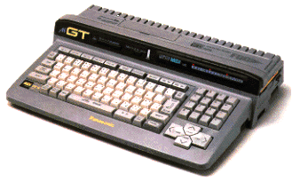

# MSX Turbo R

  

The final manufactured and most advanced MSX computer is the MSX turboR,
available in two types:

    Panasonic FS-A1ST MSX turbo R , R800 cpu, 128K, MSX2+ video
    Panasonic FS-A1GT MSX turbo R with 512K memory, SRAM disk and a midi interface

These machines were only made for the Japanese market, so buying and using
the MSX turbo R in other countries was a bit of a challenge. For example:
the builtin software is in Japanese, the documentation is in Japanese.

Users in the Netherlands (there has been a very active import circuit) have
written down instructions and impressions. This is to be found in the magazines
section.

## Technical info

[Floppy disk controller]() (email from the MSX mailing list), register info